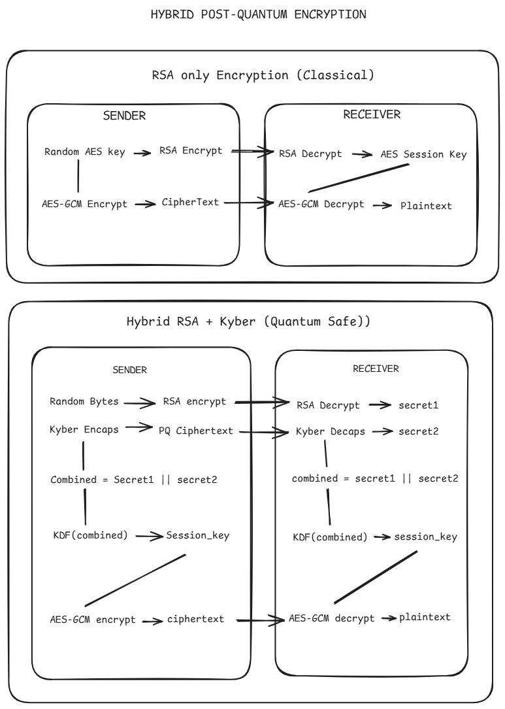

# HYBRID POST-QUANTUM ENCRYPTION

A secure messaging system demonstrating two encryption approaches:

1. **RSA-Only (Classical)** — RSA key exchange + AES-256-GCM encryption
   - Vulnerable to quantum attacks (Shor's algorithm)
2. **Hybrid RSA + Kyber (Quantum-Safe)** — Combines classical RSA and post-quantum Kyber via KDF
   - Resistant to quantum decryption attacks

Includes a **Shor's Algorithm attack demo** that breaks the RSA-only method by factoring the RSA key, recovering the AES session key, and decrypting the plaintext.


## ENCTYPTION MODES

### Mode 1: RSA-Only (Classical) — Quantum Vulnerable

## Architecture Diagram

<p>
  
</p>

### Shor's Algorithm Attack Demo

Demonstrates breaking the RSA-only encryption:

1. Reads `message.txt` (RSA-only encrypted message)
2. Loads RSA public key `(n, e)` from `keys/small_rsa_keys.json`
3. Factors `n` using a classical simulation of Shor's algorithm
4. Reconstructs private key `d` from the prime factors
5. Decrypts the RSA-encrypted AES session key
6. Decrypts AES-GCM ciphertext to recover the original plaintext

> **Why not Qiskit?** Qiskit simulates quantum circuits on classical hardware using exponentially large state vectors (2^n entries for n qubits). For even a 32-bit modulus, the circuit would need ~64+ qubits — making Qiskit **slower** than direct classical factoring. Real speedup only exists on actual quantum hardware.

## INDUSTRY STATUS
Industry is currently in a transition phase toward post-quantum cryptography. Recent measurements show that around 8–9% of the top million websites already support hybrid post-quantum key exchange, while nearly 42% of the top 100 sites have implemented it. Thousands of enterprises and governments are running pilot deployments of lattice-based cryptography such as Kyber, and major cloud providers and browsers have begun integrating hybrid TLS mechanisms. These developments accelerated after the 2024 NIST standardization of Kyber (ML-KEM). My project reflects this real-world migration strategy by demonstrating hybrid encryption that combines classical RSA with Kyber using a key derivation function to ensure quantum-resilient key exchange.


## ARCHITECTURE

```
project/
├── common/                      # Core cryptographic primitives
│   ├── rsa_utils.py             # RSA-2048 + small RSA (for Shor's demo)
│   ├── kyber_utils.py           # Kyber-512 KEM (keygen, encaps, decaps)
│   └── aes_gcm.py               # AES-256-GCM authenticated encryption
├── kdf/                         # Key Derivation Functions (3 implementations)
│   ├── hkdf.py                  # HKDF-SHA256 (RFC 5869)
│   ├── pbkdf2.py                # PBKDF2-HMAC-SHA256 (100k iterations)
│   └── scrypt_kdf.py            # Scrypt (n=16384, r=8, p=1)
├── network/                     # HTTP communication layer
│   ├── receiver_server.py       # FastAPI server (hybrid + RSA-only endpoints)
│   └── sender_server.py         # HTTP client (requests library)
├── storage/                     # Persistence layer
│   ├── key_store.py             # RSA keys (PEM) + Kyber keys (raw bytes)
│   └── message_handler.py       # JSON message file (base64-encoded fields)
├── ui/                          # Command-line interfaces
│   ├── cli_sender.py            # Hybrid sender: input → encrypt → send
│   ├── cli_receiver.py          # Hybrid receiver: receive → decrypt → display
│   ├── cli_rsa_only_sender.py   # RSA-only sender (small keys for demo)
│   └── cli_rsa_only_receiver.py # RSA-only receiver
├── attack/                      # Shor's algorithm attack demonstration
│   └── shor_attack.py           # Classical Shor's simulation + Pollard's rho
├── main_receiver.py             # Entry point: mode selection → keygen → server
├── main_sender.py               # Entry point: mode selection → encrypt → send
├── main_attack.py               # Entry point: Shor's attack on RSA-only message
└── requirements.txt
```


## COMPONENT SUMMARY

| Component | Algorithm | Purpose |
|-----------|-----------|---------|
| Classical KEM | RSA-2048 + OAEP-SHA256 | Encrypt a 32-byte random secret (hybrid mode) |
| Small RSA | Raw RSA (~32-bit modulus) | Key exchange for Shor's demo (RSA-only mode) |
| Post-Quantum KEM | Kyber-512 (CRYSTALS) | Encapsulate a 32-byte PQ shared secret |
| Key Derivation | HKDF / PBKDF2 / Scrypt | Merge both secrets → 256-bit session key |
| Encryption | AES-256-GCM | Authenticated encryption (confidentiality + integrity) |
| Attack | Shor's + Pollard's rho | Factor RSA modulus to break RSA-only mode |

## KDF COMPARISION

| KDF | Salt | Properties | Best For |
|-----|------|-----------|----------|
| **HKDF** | None | Fast, standard (RFC 5869) | High-entropy input (recommended) |
| **PBKDF2** | 16 bytes | Slow (100k iterations), CPU-bound | Password stretching scenarios |
| **Scrypt** | 16 bytes | Memory-hard (16 MB), CPU+RAM bound | Brute-force resistance |

> PBKDF2 and Scrypt salts are generated by the sender and included in the message JSON so the receiver can re-derive the same key.

## MESSAGE FORMATS

### Hybrid Mode (`message.txt`)

```json
{
  "ciphertext": "<base64>",
  "nonce": "<base64>",
  "rsa_encrypted_secret": "<base64>",
  "pq_ciphertext": "<base64>",
  "kdf_used": "HKDF",
  "salt": "<base64 or null>"
}
```

### RSA-Only Mode (`message.txt`)

```json
{
  "ciphertext": "<base64>",
  "nonce": "<base64>",
  "rsa_encrypted_key": "<integer as string>",
  "encryption_mode": "RSA_ONLY",
  "session_key_length": 3
}
```

## API ENDPOINTS (Receiver Server)

| Method | Endpoint | Mode | Description |
|--------|----------|------|-------------|
| `GET` | `/get_public_keys` | Hybrid | Returns base64-encoded RSA (PEM) + Kyber public keys |
| `POST` | `/receive_message` | Hybrid | Accepts hybrid encrypted message, decrypts + displays |
| `GET` | `/get_rsa_public_key` | RSA-Only | Returns small RSA public key (n, e) |
| `POST` | `/receive_rsa_only_message` | RSA-Only | Accepts RSA-only encrypted message, decrypts + displays |

---

## SETUP & RUN

### Prerequisites

- Python 3.9+

### 1. Create Virtual Environment

```powershell
cd e:\Temp\hybrid-encryption
python -m venv venv
.\venv\Scripts\Activate.ps1       # PowerShell
# OR: .\venv\Scripts\activate.bat  # CMD
```

### 2. Install Dependencies

```bash
pip install -r requirements.txt
```

### 3. Run RSA-Only Mode (Quantum Vulnerable)

**Terminal 1 — Receiver:**

```bash
python main_receiver.py
# Choose option 1 (RSA-Only)
```

**Terminal 2 — Sender:**

```bash
python main_sender.py
# Choose option 1 (RSA-Only)
# Enter your message
```

### 4. Run Hybrid Mode (Quantum Safe)

**Terminal 1 — Receiver:**

```bash
python main_receiver.py
# Choose option 2 (Hybrid RSA + Kyber)
```

**Terminal 2 — Sender:**

```bash
python main_sender.py
# Choose option 2 (Hybrid RSA + Kyber)
# Enter your message
# Select KDF (1 = HKDF, 2 = PBKDF2, 3 = Scrypt)
```

### 5. Run Shor's Algorithm Attack

After running RSA-Only mode (step 3), run the attack in any terminal:

```bash
python main_attack.py
```

Output shows step-by-step:
```
SHOR'S ALGORITHM ATTACK DEMONSTRATION
─────────────────────────────────────────
STEP 1: Loading encrypted message from message.txt
STEP 2: Loading RSA public key
STEP 3: Factoring n using Shor's Algorithm
  [Shor] ✅ Non-trivial factor found
STEP 4: Reconstructing RSA private key from factors
STEP 5: Decrypting RSA-encrypted AES session key
STEP 6: Decrypting AES-GCM ciphertext
  🔓 RECOVERED PLAINTEXT: Hello Shaurya
```

---

## Why Hybrid?

- **RSA alone** is vulnerable to future quantum attacks (Shor's algorithm can factor any RSA key)
- **Kyber alone** is relatively new and may have undiscovered classical weaknesses
- **Hybrid** = security of *both*: even if one is broken, the other still protects the key

This project demonstrates the vulnerability of RSA-only key exchange and why post-quantum hybrid approaches are necessary for future-proof encryption.

---

## TECH STACK

| Library | Version | Purpose |
|---------|---------|---------|
| `cryptography` | latest | RSA, AES-GCM, HKDF, PBKDF2, Scrypt |
| `kyber-py` | latest | Pure-Python Kyber-512 KEM |
| `fastapi` | latest | Async HTTP server |
| `uvicorn` | latest | ASGI server for FastAPI |
| `requests` | latest | Synchronous HTTP client |
